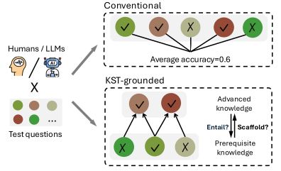

# Do LLMs Exhibit Coherent Knowledge Structures in Mathematical Reasoning?

 [](https://2026.emnlp.org/) [](https://opensource.org/licenses/MIT)


Implementation of [**Do LLMs Exhibit Coherent Knowledge Structures in Mathematical Reasoning? A Perspective from Knowledge Space Theory**](https://arxiv.org/abs/2609.05245). Peng Cui, Heejin Do, Mrinmaya Sachan · ETH Zürich

## Abstract

>  Human knowledge is inherently structured and interdependent: mastery of a concept requires prior mastery of its prerequisites, a principle formalized by Knowledge Space Theory (KST). While LLMs achieve strong performance on complex reasoning tasks, it remains unclear whether they exhibit coherent, human-like knowledge structure. We introduce a KST-grounded framework for evaluating LLM knowledge structure in mathematical reasoning, using it as a normative framework to analyze whether LLM behavior adheres to principled knowledge dependencies. Evaluating eight open- and closed-source LLMs against real human learners, we find that (1) LLMs do not adhere to human knowledge structure—they frequently violate knowledge dependencies and fail to leverage related knowledge provided in context to improve performance on dependent questions; (2) LLMs do not share a consistent knowledge structure among themselves, as reflected by low overlap in their knowledge distributions. Furthermore, these structural deficiencies remain largely invisible to accuracy-based and LLM-as-judge evaluations. Together, our results provide behavioral evidence that current LLMs knowledge does not follow a human-like structure.


<p align="center">    </p>


## Usage

**Data**:  Our data can be downloaded from [here](https://drive.google.com/file/d/1M1pSEtzZNupeFXoaF_13PqJA9FeqGafF/view?usp=sharing), which includes the XES3G5M dataset and the prerequisite pairs we extracted.  

To reproduce our main results, place the dataset folder under data, and run `sh scripts/eval_psr.sh` .  


## Citation

If you find this work useful, please cite as:

```
@article{cui2026llmsexhibitcoherentknowledge,
      title={Do LLMs Exhibit Coherent Knowledge Structures in Mathematical Reasoning? A Perspective from Knowledge Space Theory}, 
      author={Peng Cui and Heejin Do and Mrinmaya Sachan},
      year={2026},
      eprint={2609.05245},
      archivePrefix={arXiv},
      primaryClass={cs.AI},
      url={https://arxiv.org/abs/2609.05245}, 
}
```


